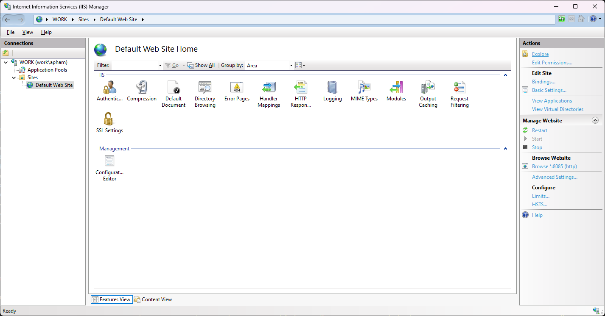

# TOC

- [TOC](#toc)
- [Project description](#project-description)
- [Run the project in console](#run-the-project-in-console)
- [Build to deploy on IIS](#build-to-deploy-on-iis)
- [Install dotnet auto instrumentation](#install-dotnet-auto-instrumentation)
  - [Online method](#online-method)
  - [Offline method](#offline-method)
  - [FYI : Full list with latest version](#fyi--full-list-with-latest-version)
- [Run project with instrumentation](#run-project-with-instrumentation)
  - [List of options accessible via Environment Variables](#list-of-options-accessible-via-environment-variables)
  - [Console mode](#console-mode)
  - [IIS mode](#iis-mode)

# Project description 
This project is to illustrate how to do autoinstrumentation on a dotnet deployed on IIS.


# Run the project in console

```
# In Powershell
dotnet run
```

test call

```
# In Powershell
curl http://localhost:5100/api/books
```

# Build to deploy on IIS

```
# In Powershell
dotnet publish --configuration Release
```

Copy bin/Release/net6.0/publish to physical path in IIS Manager.

Folder can be found here when clicking on explore in IIS Manager.


# Install dotnet auto instrumentation 

Download the following assets :

 - Install script :
https://github.com/open-telemetry/opentelemetry-dotnet-instrumentation/releases/download/v1.0.2/OpenTelemetry.DotNet.Auto.psm1

 - Binaries :
https://github.com/open-telemetry/opentelemetry-dotnet-instrumentation/releases/download/v1.0.2/opentelemetry-dotnet-instrumentation-windows.zip


## Online method

```
# in Powershell as administrator

$module_url = "https://raw.githubusercontent.com/open-telemetry/opentelemetry-dotnet-instrumentation/v1.0.2/OpenTelemetry.DotNet.Auto.psm1"
$download_path = Join-Path $env:temp "OpenTelemetry.DotNet.Auto.psm1"

# Download assets
Invoke-WebRequest -Uri $module_url -OutFile $download_path -UseBasicParsing

# importing &modules
Import-Module $download_path

# Install Otel core
Install-OpenTelemetryCore

# Register for IIS (this will cause IIS to restart)
Register-OpenTelemetryForIIS 

```

## Offline method

```
Import-Module OpenTelemetry.DotNet.Auto.psm1

Install-OpenTelemetryCore -LocalPath "C:\Path\To\opentelemetry-dotnet-instrumentation-windows.zip"" 
```

## FYI : Full list with latest version
https://github.com/open-telemetry/opentelemetry-dotnet-instrumentation/releases


# Run project with instrumentation

## List of options accessible via Environment Variables
https://opentelemetry.io/docs/instrumentation/net/automatic/config/


## Console mode
```

Register-OpenTelemetryForCurrentSession -OTelServiceName "MyServiceDisplayName"

$Env:OTEL_EXPORTER_OTLP_ENDPOINT="http://localhost:4317"
$Env:OTEL_EXPORTER_OTLP_PROTOCOL="grpc"

bin\Release\net6.0\MyBookstoreApi.exe
```

## IIS mode

edit bin\Release\net6.0\publish\web.config before copying publish folder onto IIS

```
<?xml version="1.0" encoding="utf-8"?>
<configuration>
  <location path="." inheritInChildApplications="false">
    <system.webServer>
      <handlers>
        <add name="aspNetCore" path="*" verb="*" modules="AspNetCoreModuleV2" resourceType="Unspecified" />
      </handlers>
      <aspNetCore processPath="dotnet" arguments=".\MyBookstoreApi.dll" stdoutLogEnabled="false" stdoutLogFile=".\logs\stdout" hostingModel="inprocess" >
		  <environmentVariables>
			<environmentVariable name="OTEL_SERVICE_NAME" value="mybookstore" />
			<environmentVariable name="OTEL_EXPORTER_OTLP_ENDPOINT" value="http://localhost:4318" />
			<environmentVariable name="OTEL_RESOURCE_ATTRIBUTES" value="service.namespace=name,deployment.environment=production,service.instance.id=server-name,service.version=1.0.0" />
		  </environmentVariables>
	  </aspNetCore>
    </system.webServer>
  </location>
</configuration>
```